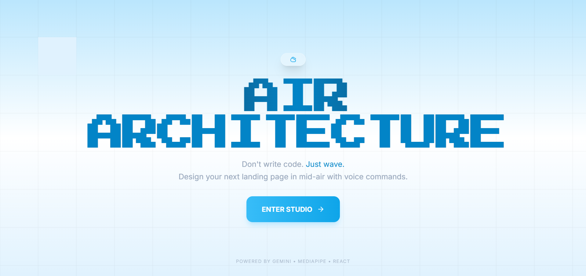

# AIR ARCHITECT ☁️✨

> **Design in mid-air. Code with a voice.**



## 🚀 Overview

**Air Architect** allows you to build website layouts efficiently using **hand gestures** and **voice commands**. Forget drag-and-drop editors—simply pinch to draw your wireframe in the air and speak your design intentions (e.g., _"Make it a modern dark-themed portfolio"_).

## 📸 Demos

**From Air Gesture to Real Website.**

|      Hand-Drawn Wireframe (Input for a signup form)      |                 AI-Generated Website (Output)                  |
| :------------------------------------------------------: | :------------------------------------------------------------: |
|  |  |
|             _User draws a layout in mid-air_             |             _Gemini generates full HTML/Tailwind_              |

|    Hand-Drawn Wireframe (Input for a admin dashboard)    |                 AI-Generated Website (Output)                  |
| :------------------------------------------------------: | :------------------------------------------------------------: |
|  |  |

### 🎥 Video Demo

<div>
  <a href="https://youtu.be/_-51i2fl4Nw">
    
  </a>
  <br />
  <i>Click to watch the full workflow in action.</i>
  <br />
  <br />
</div>

> "Rapid prototyping has never been this intuitive. Air Architect removes the friction between idea and implementation by allowing developers to draw layouts on camera and guide the design with voice commands. It captures your gestures and speech simultaneously to auto-generate clean, responsive frontend code—cutting the time from concept to codebase in half."

## 🛠️ Built With

### Languages

- **JavaScript (ES6+)**
- **HTML5**
- **CSS3**

### Frameworks & Libraries

- **React 18**
- **Vite**
- **Tailwind CSS**
- **Zustand**
- **Lucide React**

### AI & Machine Learning

- **Google Gemini 2.5 Flash** (Layout Generation)
- **Google Gemini 3 Flash Preview** (Voice Transcription)
- **Google MediaPipe** (Hand Tracking)

### APIs & Browser Standards

- **MediaRecorder API**
- **HTML5 Canvas API**
- **WebRTC (getUserMedia)**
- **Pexels API**

## 🏁 Getting Started

### Prerequisites

- Node.js (v18+)
- A Google Gemini API Key
- A Pexels API Key

### Installation

1. **Clone the repository**

    ```bash
    git clone https://github.com/Rahul-R79/Air-Architect.git
    cd Air-Architect
    ```

2. **Install dependencies**

    ```bash
    npm install
    ```

3. **Configure Environment**
   Create a `.env` file in the root directory:

    ```env
    VITE_GEMINI_API_KEY=your_api_key_here
    VITE_PEXELS_API_KEY=your_api_key_here
    ```

4. **Run Development Server**

    ```bash
    npm run dev
    ```

5. Open [http://localhost:5173](http://localhost:5173) to view it in the browser. Allow camera and microphone permissions when prompted.

---